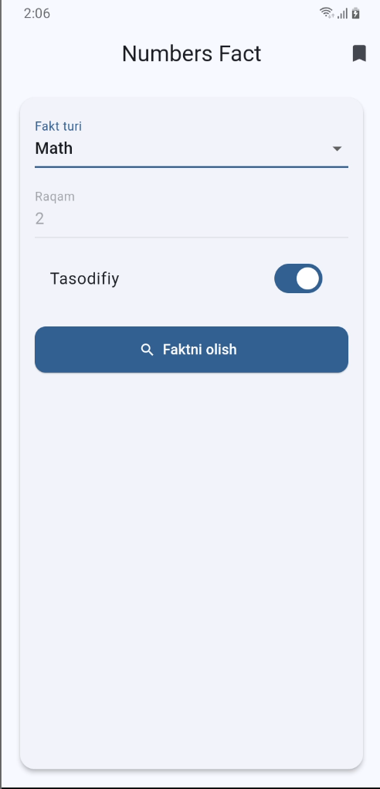
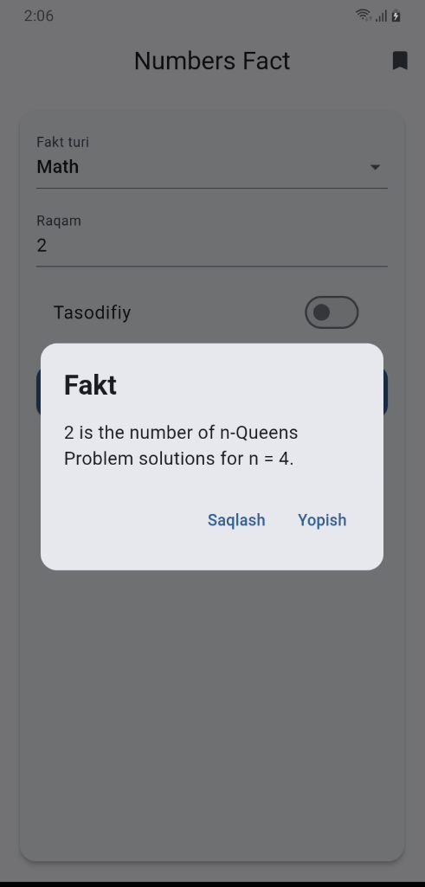
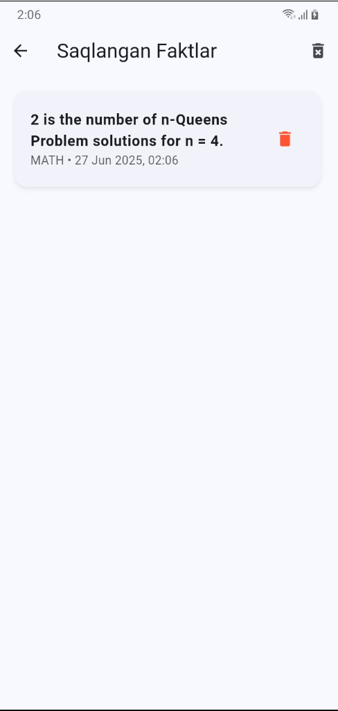

# 📱 Number Fact App

Flutter asosidagi ilova bo‘lib, foydalanuvchiga **raqamlar**, **matematik**, **sana (date)** va **qiziqarli faktlar (trivia)** haqida ma’lumot beradi. Ilova internet orqali [NumbersAPI](http://numbersapi.com) dan foydalanadi va ma’lumotlarni **offline rejimda saqlash** imkonini beradi.

---

## 🧩 Ilovaning asosiy imkoniyatlari

✅ `Trivia`, `Math` yoki `Date` turidagi faktlarni olish
✅ Tasodifiy faktlarni olish imkoniyati
✅ Sana tanlash uchun maxsus dropdown (oy/kun)
✅ Faktlarni lokal saqlash (`Hive`)
✅ Saqlangan faktlar ro‘yxatini ko‘rish
✅ Har birini yoki barchasini o‘chirish
✅ Internet yo‘qligida ogohlantirish (`connectivity_plus`)
✅ Yengil va qorong‘i (`dark`) dizayn rejimi
✅ Xatoliklar uchun qulay foydalanuvchi ogohlantirishlari

---

## 📷 Ilovadan ko‘rinishlar

| Bosh sahifa | Fakt oynasi | Saqlanganlar |
|------------|-------------|---------------|
|  |  |  |

---

## 🛠 Texnologiyalar

- **Flutter 3.8.0**
- `Dio` – HTTP so‘rovlar uchun
- `Hive` – lokal ma’lumotlar saqlash uchun
- `hive_flutter` – Flutter bilan integratsiya
- `intl` – Sana formatlash
- `connectivity_plus` – Internet holatini tekshirish
- `path_provider` – fayl tizimi yo‘llari uchun

---

## 📁 Loyihaning tuzilmasi
